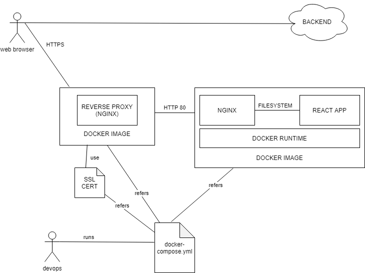

# react-docker-app



1. crear app de react

```bash
npx create-react-app react-app-docker
cd react-app-docker
```

2. agregar Dockerfile
3. agregar configuración de nginx
4. generar imagen (build docker image) `docker build -t react-app:1 .`
5. correr un contenedor con la imagen `docker run -it --rm -p 3000:80 react-app:1`
6. acceder a `http://localhost:3000`
7. profit
